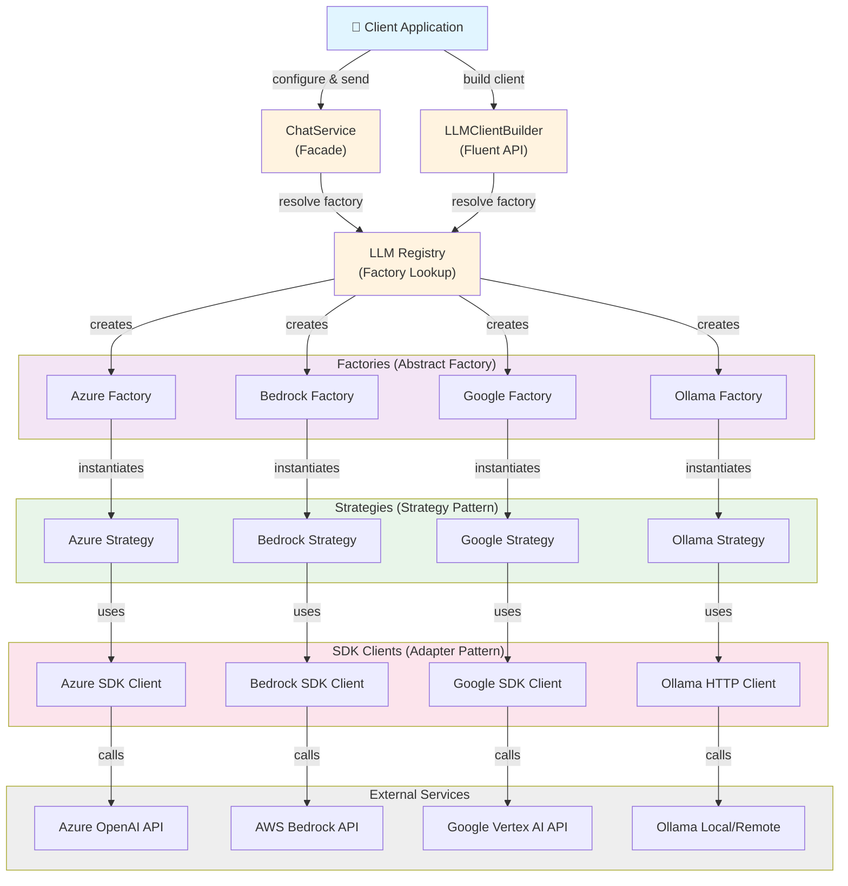

# Integration-LLM

A TypeScript library demonstrating a **provider-agnostic LLM integration layer** using enterprise design patterns. This project enables seamless switching between multiple LLM providers (Azure OpenAI, AWS Bedrock, Google Vertex AI, Ollama) with a unified interface.

## 🎯 Overview

Integration-LLM provides a clean abstraction layer for interacting with Large Language Models across different cloud providers. The architecture demonstrates 3 key design patterns:

- **Strategy Pattern**: Unified `LLMStrategy` interface enables runtime provider switching
- **Abstract Factory Pattern**: Each platform has a dedicated factory for creating strategy instances
- **Adapter Pattern**: Platform-specific implementations adapt vendor APIs to a common response format

## 📊 Architecture Diagram



## ⚡ Current Status

> **Note**: The provider clients are typed mock implementations. They return predictable sample responses and do **not** make live requests to external APIs. This allows for development and testing without credentials.

## 🚀 Supported Platforms

| Platform | Example Models | Status |
|----------|---|---|
| **AWS Bedrock** | `anthropic.claude-v2`, `mistral.large`, `meta.llama2-70b` | ✅ Mock |
| **Azure OpenAI** | `gpt-4o-mini`, `gpt-35-turbo`, `gpt-4o` | ✅ Mock |
| **Google Vertex AI** | `gemini-pro`, `gemini-1.0-pro`, `text-unicorn-latest` | ✅ Mock |
| **Ollama** | `llama3.2`, `gemma3`, `qwen3` | ✅ Mock |

## 📋 Requirements

- Node.js 18 or later
- npm 9 or later

## 📦 Installation & Setup

```bash
# Install dependencies
npm install

# Build TypeScript
npm run build

# Run tests
npm test

# Run the demo
npm run demo

# Run tests in watch mode
npm run test:watch

# Lint code
npm lint
```

## 🔧 Usage Examples

### Basic Usage

```typescript
import {
  ChatService,
  registerDefaultFactories
} from './src/index.js';

// Register all default platform factories
registerDefaultFactories();

// Create and configure the service
const chatService = new ChatService();

chatService.configure({
  platform: 'azure',
  model: 'gpt-4o-mini'
});

// Send a message
const response = await chatService.send('Explain the adapter pattern.');

console.log(response.content);
console.log(response.usage.totalTokens);
```

### Using the Fluent Builder

```typescript
import {
  LLMClientBuilder,
  registerDefaultFactories
} from './src/index.js';

registerDefaultFactories();

const response = await LLMClientBuilder
  .create()
  .withPlatform('google')
  .withModel('gemini-pro')
  .send('What is machine learning?');

console.log(response.content);
```

### Streaming Messages

```typescript
const chatService = new ChatService();
chatService.configure({
  platform: 'bedrock',
  model: 'anthropic.claude-v2'
});

// Stream response chunks
for await (const chunk of chatService.stream('Tell me a story.')) {
  process.stdout.write(chunk.content);
}
```

### Runtime Provider Switching

```typescript
const chatService = new ChatService();

// Use Azure initially
chatService.configure({ platform: 'azure', model: 'gpt-4o-mini' });
let response = await chatService.send('Hello!');

// Switch to Bedrock
chatService.configure({ platform: 'bedrock', model: 'anthropic.claude-v2' });
response = await chatService.send('Hello!');

// View current configuration
console.log(chatService.getCurrentConfiguration());
```

## 📂 Project Structure

```
src/
├── core/                      # Core interfaces & types
│   ├── chat-types.ts         # ChatOptions, ChatResponse, StreamingChunk
│   ├── llm-strategy.ts       # LLMStrategy interface (Strategy Pattern)
│   └── llm-factory.ts        # LLMFactory interface (Abstract Factory)
│
├── platforms/                # Platform-specific implementations
│   ├── factory-resolver.ts   # Factory resolution logic
│   ├── register.ts           # Factory registration helpers
│   ├── sdk-clients.ts        # Mock SDK client implementations
│   ├── azure/                # Azure OpenAI platform
│   │   ├── azure-factory.ts
│   │   └── azure-strategy.ts
│   ├── bedrock/              # AWS Bedrock platform
│   │   ├── bedrock-factory.ts
│   │   └── bedrock-strategy.ts
│   ├── google/               # Google Vertex AI platform
│   │   ├── google-factory.ts
│   │   └── google-strategy.ts
│   └── ollama/               # Ollama platform
│       ├── ollama-factory.ts
│       └── ollama-strategy.ts
│
├── registry/                 # Factory registry & lookup
│   └── llm-registry.ts      # Central registry for factories
│
├── service/                  # High-level services
│   ├── chat-service.ts      # Main ChatService facade
│   ├── chat-service.test.ts # Service tests
│   └── llm-client-builder.ts # Fluent API builder
│
├── demo.ts                   # Demonstration script
└── index.ts                  # Public API exports
```

## 🏗️ Design Patterns

### 1. Strategy Pattern
Each LLM platform implements the `LLMStrategy` interface, allowing the application to switch implementations at runtime without changing client code.

```typescript
export interface LLMStrategy {
  sendMessage(prompt: string, options?: ChatOptions): Promise<ChatResponse>;
  streamMessage(prompt: string, options?: ChatOptions): AsyncIterable<StreamingChunk>;
}
```

### 2. Abstract Factory Pattern
Each platform has a dedicated factory that creates the appropriate strategy instance for a given model.

```typescript
export interface LLMFactory {
  createClient(modelId: string): LLMStrategy;
}
```

### 3. Adapter Pattern
Platform-specific implementations adapt vendor-specific APIs and response formats into the unified `ChatResponse` format.

## 🧪 Testing

The project includes comprehensive test coverage using Vitest:

```bash
# Run all tests
npm test

# Run tests in watch mode
npm run test:watch
```

Key test file:
- [src/service/chat-service.test.ts](src/service/chat-service.test.ts) - ChatService unit tests

## 🔗 Exports

The public API provides access to:

```typescript
// Types
export type { ChatOptions, ChatResponse, StreamingChunk }
export type { LLMStrategy, LLMFactory }

// Services
export { ChatService }
export { LLMClientBuilder }
export { llmRegistry }

// Initialization
export { registerDefaultFactories }
```

## 🤝 Contributing

Contributions are welcome! Please ensure:
- All tests pass (`npm test`)
- Code is linted (`npm run lint`)
- TypeScript compilation succeeds (`npm run build`)

## 📄 License

ISC

## 🔗 Repository

[Charan-Hari/Integration-LLM](https://github.com/Charan-Hari/Integration-LLM)